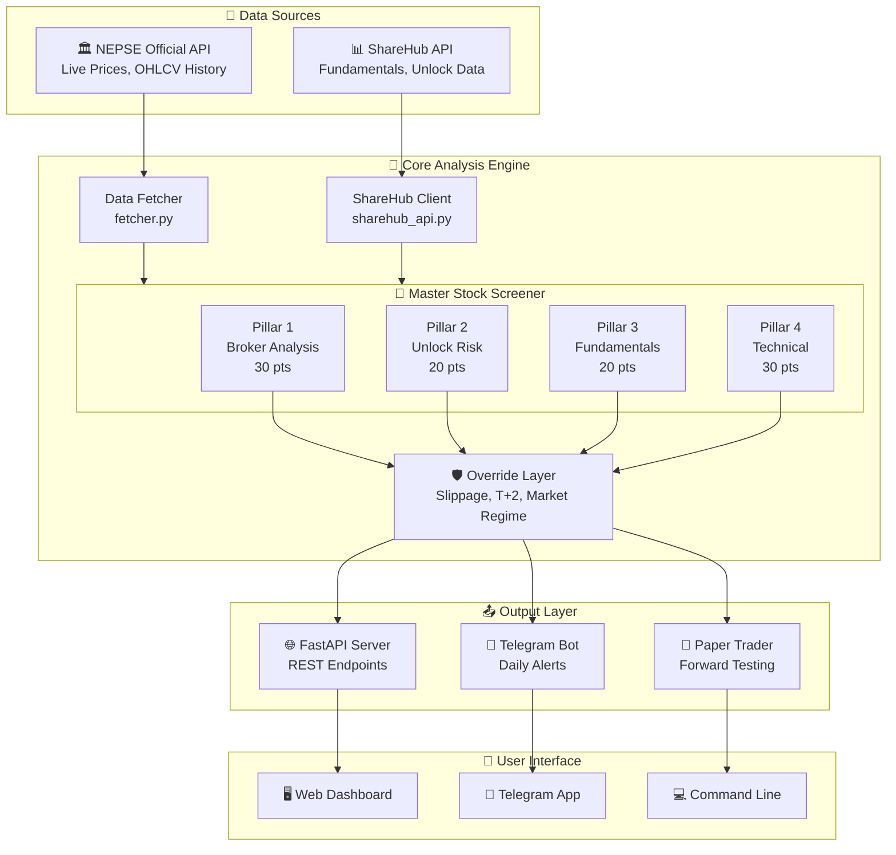
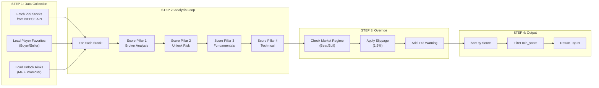
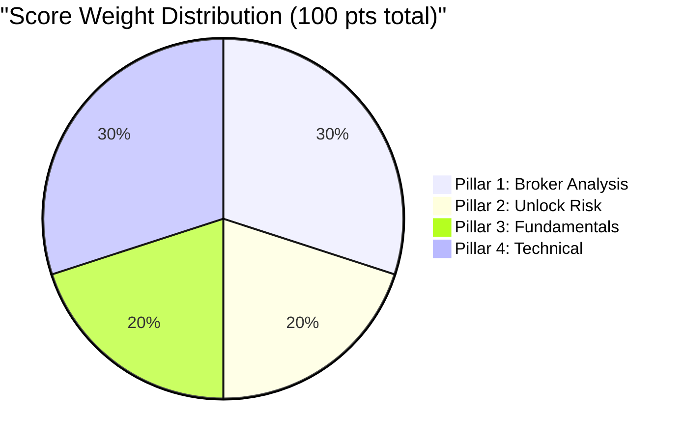
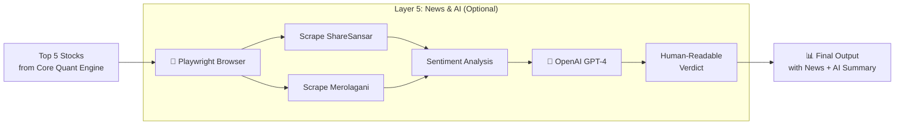
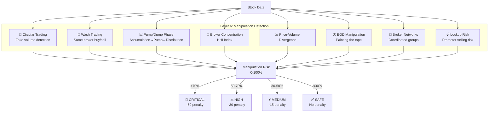
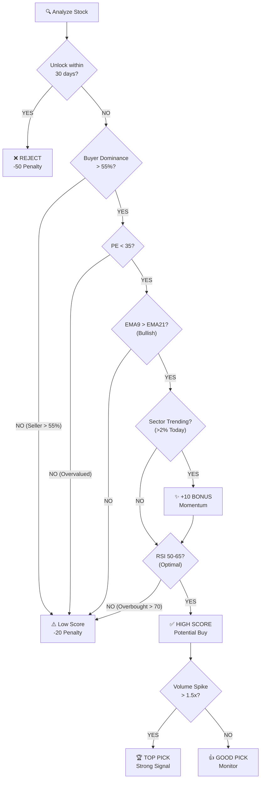
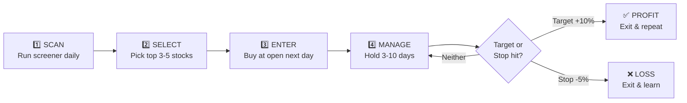

# 📚 NEPSE AI Trading Bot - Complete User Guide

> **Version:** 1.0  
> **Last Updated:** 2026-03-21  
> **Author:** AI Quantitative Engine

---

## ⚡ Quick Reference Card (TL;DR)

```bash
# 🔄 DAILY WORKFLOW (Copy-Paste Ready)

# Step 1: Check portfolio status (10:00 AM)
python tools/paper_trader.py --portfolio

# Step 2: Run daily scan (2:30 PM)
python tools/paper_trader.py --scan --strategy=momentum

# Step 3: Buy top picks (if portfolio empty)
python tools/paper_trader.py --buy-picks

# Step 4: Sell when exit signal appears (Day 8+)
python tools/paper_trader.py --sell SYMBOL --sell-price 580
```

| Action | What It Does | When to Run |
|--------|--------------|-------------|
| `--portfolio` | View holdings with P&L, days held, exit levels | Daily 10:00 AM |
| `--scan` | Find top 5 stocks to buy | Daily 2:30 PM |
| `--buy-picks` | Buy top scan picks or specific stocks | When portfolio empty |
| `--sell` | Exit a position | When exit signal appears |
| `--analyze` | Deep analysis of a single stock | When friend recommends |
| `stealth-scan` | Detect smart money sector rotation | Any time (works offline!) |

| Flag | Purpose | Example |
|------|---------|---------|
| `--portfolio` | View portfolio with holding rules | `python paper_trader.py --portfolio` |
| `--buy-picks GVL PPCL` | Buy specific stocks | `--buy-picks GVL PPCL HPPL` |
| `--quick` | Analyze top 50 stocks only (faster) | `--scan --quick` |
| `--full` | Add news + AI analysis | `--scan --quick --full` |
| `--strategy=momentum` | Trend-following mode | `--strategy=momentum --sector=hydro` |
| `--sector=bank` | Filter by sector | `--sector=finance` |
| `--max-price=500` | Budget filter | `--max-price=400` |
| `--analyze NHPC` | Analyze specific stock | `--analyze NHPC` |

### 📊 Portfolio Rules (MEMORIZE THESE!)

| Rule | Value | Meaning |
|------|-------|---------|
| **MAX ALLOCATION** | 9% | Only 9% of portfolio in swing trades |
| **MAX STOCKS** | 3 | Maximum 3 positions at once |
| **HOLD PERIOD** | 7 days | NO selling during first 7 days |
| **PROFIT TARGET** | +10% | Sell when +10% profit |
| **STOP LOSS** | -5% | Sell when -5% loss |
| **MAX HOLD** | 15 days | Force review after 15 days |

---

## 📑 Table of Contents

1. [System Overview](#system-overview)
2. [Architecture Diagram](#architecture-diagram)
3. [Installation & Setup](#installation--setup)
4. [How to Use](#how-to-use)
5. [Understanding the Output](#understanding-the-output)
6. [Market Knowledge for Beginners](#market-knowledge-for-beginners)
7. [Trading Strategy Guide](#trading-strategy-guide)
8. [Risk Management](#risk-management)
9. [Troubleshooting](#troubleshooting)
10. [FAQ](#faq)

---

## 🎯 System Overview

### What This System Does

This is a **proprietary AI-powered stock screening engine** specifically designed for NEPSE (Nepal Stock Exchange). It analyzes **ALL 299+ listed stocks** daily and identifies the best swing trading opportunities.

### Key Features

| Feature | Description |
|---------|-------------|
| 🔍 **6-Pillar Analysis** | Broker, Unlock Risk, Fundamentals, Technical, News/AI, Manipulation |
| 🚨 **Manipulation Detection** | 9 detectors for insider operator games |
| 📊 **Real Technical Indicators** | EMA, RSI, MACD, ADX using pandas-ta |
| 🛡️ **Risk Protection** | Slippage modeling, T+2 warnings, unlock alerts |
| 📈 **Paper Trading** | Forward-test the algorithm with virtual portfolio |
| 🌐 **Web API** | REST API for integration with any frontend |

### What Makes This Different

```
❌ NOT a simple "Top Picks" API wrapper
❌ NOT relying on external recommendations
❌ NOT using pre-computed scores

✅ Analyzes EVERY stock from scratch
✅ Calculates OUR OWN proprietary score
✅ Applies NEPSE-specific rules (not US market)
✅ Models real-world execution challenges
```

---

## 🏗️ Architecture Diagram

### High-Level System Architecture



### Data Flow Architecture



### Core Scoring Breakdown (4 Pillars + Layered Intelligence)



### 📰🤖 Optional 5th Layer: News & AI Intelligence

After the core 4-pillar scoring, you can optionally enable:



**How it works:**
1. Takes top stocks from the core scoring engine
2. Opens headless Chrome browser via Playwright
3. Scrapes recent news from ShareSansar & Merolagani
4. Analyzes sentiment (bullish/bearish keywords)
5. Calls OpenAI GPT to generate human-readable explanation
6. Adjusts final score based on news sentiment

**Requirements:**
```bash
pip install playwright openai
playwright install chromium
# Set OPENAI_API_KEY in .env file
```

### 🚨 6th Layer: Manipulation Detection (Insider Intelligence)

The system includes a **9-detector manipulation detection engine** that identifies operator games and insider manipulation patterns:



**What Each Detector Finds:**

| Detector | What It Detects | Red Flag Threshold |
|----------|-----------------|-------------------|
| 🔄 Circular Trading | Brokers with balanced buy/sell (fake volume) | >20% circular volume |
| 🧹 Wash Trading | Same broker buying & selling to itself | >70% buy/sell match |
| 📈 Pump/Dump Phase | Current phase: Accumulation, Pump, or Distribution | Distribution phase |
| 🏦 Broker Concentration | Top brokers controlling too much | HHI >2500 |
| 📉 Price-Volume Divergence | High volume but price not moving (absorption) | Volume >2x, price <2% |
| 🕐 EOD Manipulation | "Painting the tape" at close | Close at 90%+ range |
| 🔗 Broker Networks | Coordinated buying by connected brokers | >3 brokers coordinated |
| 🔓 Lockup Risk | Promoter shares about to unlock | <30 days to unlock |

**Example Output:**
```
🚨 MANIPULATION RISK ANALYSIS (Insider Operator Detection)
----------------------------------------------------------------------

   📊 MANIPULATION RISK SCORE: [███░░░░░░░] 33%
   Severity: MEDIUM
   Trading Status: ✅ SAFE TO TRADE

   📈 OPERATOR PHASE: ✅ CLEAN
      No clear pump/dump pattern detected

   📋 KEY METRICS:
      • Broker Concentration (HHI): 370 ✅ OK
      • Top 3 Brokers Control: 24%
      • Circular Trading: 45% 🚨 FAKE VOLUME!
      • Wash Trading: 🚨 DETECTED

   🚨 DETECTED PATTERNS:
      🔴 Circular Trading: 45%
      🔴 Wash Trading: 18 brokers

   💡 What this means:
      No clear manipulation pattern. Analyze fundamentals normally.
```

**Understanding Operator Phases:**
- **ACCUMULATION**: Operators silently buying - early entry opportunity
- **PUMP**: Volume spike + price surge - late entry risk, don't chase
- **DISTRIBUTION**: Operators exiting while retail buys - AVOID new positions
- **CLEAN**: No clear manipulation pattern

### Decision Tree for Stock Selection



---

## 🔧 Installation & Setup

### Prerequisites

- Python 3.9+
- pip (Python package manager)
- Internet connection (for API calls)

### Step-by-Step Installation

```bash
# 1. Navigate to project directory
cd /path/to/nepse_ai_trading

# 2. Create virtual environment (recommended)
python -m venv venv
source venv/bin/activate  # Linux/Mac
# OR
venv\Scripts\activate     # Windows

# 3. Install dependencies
pip install -r requirements.txt

# 4. Set up environment variables (optional)
cp .env.example .env
# Edit .env with your API keys if needed
```

### Verify Installation

```bash
# Test the screener
python -c "from analysis.master_screener import MasterStockScreener; print('✅ Installation successful!')"
```

---

## 📅 YOUR DAILY TRADING ROUTINE (Step-by-Step)

This section explains **exactly what to do every trading day** to use the NEPSE AI Trading Bot effectively.

### ⏰ The Perfect Daily Schedule

| Time | Action | Command | Why |
|------|--------|---------|-----|
| **10:00 AM** | Check Portfolio | `--portfolio` | See holdings, P&L, days held |
| **2:30 PM** | Run Daily Scan | `--scan --strategy=momentum` | Get today's top picks |
| **2:45 PM** | Review & Decide | - | Check if portfolio has slots |
| **2:55 PM** | Buy (if empty) | `--buy-picks` | Buy top 3 picks |
| **Day 8+** | Check Exit Signals | `--portfolio` | Sell if +10% or -5% |

---

### 🔄 Step-by-Step Daily Workflow

#### **Step 1: Check Portfolio Status (10:00 AM)**
Before doing anything else, check your current holdings and exit signals.

```bash
python tools/paper_trader.py --portfolio
```

**What this command does (AUTOMATICALLY):**
1. ✅ Fetches **LIVE LTP** from NEPSE API
2. ✅ Calculates P&L = (LTP - Buy Price) / Buy Price × 100
3. ✅ Counts trading days held (excludes Fri/Sat)
4. ✅ Checks exit triggers (+10%, -5%, 15 days)
5. ✅ Shows up/down arrows (↑↓) for movements

**Output Example (with LIVE updates):**
```
============================================================
📊 PORTFOLIO STATUS (Auto-Updated) (24-Mar)
============================================================

SYMBOL   |    BUY ₹ |   DAYS |   P&L% (LIVE) |   LTP ₹ (LIVE) | STATUS
--------------------------------------------------------------------------------
GVL      |      526 |    3/7 |       +2.1% ↑ |          537 ↑ | 🟢 HOLD (Day 3/7)
PPCL     |      429 |    3/7 |       -0.5% ↓ |          427 ↓ | 🟢 HOLD (Day 3/7)
HPPL     |      522 |    3/7 |       +1.3% ↑ |          529 ↑ | 🟢 HOLD (Day 3/7)
--------------------------------------------------------------------------------
TOTAL: 9.0% allocation | +1.0% P&L | Next review: 30-Mar

⚠️ NO SELL SIGNALS (In hold period)

🔄 AUTO-UPDATE INFO
   ✅ LTP fetched LIVE from NEPSE API
   ✅ P&L calculated automatically
   ✅ Exit signals checked every run
   ✅ Run anytime: Market hours → Live | Closed → Last close

⚠️ EXIT LEVELS
   GVL: +10% target = Rs.579 | -5% stop = Rs.500
   PPCL: +10% target = Rs.472 | -5% stop = Rs.408
   HPPL: +10% target = Rs.574 | -5% stop = Rs.496
```

**What to look for:**
- 🟢 **HOLD** = Stay in position (within 7-day hold period)
- 🎯 **SELL TARGET** = +10% hit, take profit!
- 🛑 **SELL STOP** = -5% hit, cut loss!
- ⏰ **REVIEW** = 15+ days, make a decision
- ↑ **Green arrows** = Price/P&L increasing
- ↓ **Red arrows** = Price/P&L decreasing

**Market Hours Handling:**
- **Market open (11AM-3PM):** Shows real-time prices
- **Market closed / weekends:** Shows last close
- **Run anytime:** Command ALWAYS works!

**Recommended check times:**
```bash
10:00 AM: --portfolio  # Morning overview
12:00 PM: --portfolio  # Midday live update
3:15 PM:  --portfolio  # Final close prices
```

#### **Step 2: Run the Daily Scan (2:30 PM)**
After market settles, run the momentum scanner to find opportunities.

```bash
# Momentum scan (recommended for swing trading)
python tools/paper_trader.py --scan --strategy=momentum

# Sector-specific scan
python tools/paper_trader.py --scan --strategy=momentum --sector=hydro

# With news and AI analysis
python tools/paper_trader.py --scan --strategy=momentum --full
```

**What this does:**
- Scores all stocks using the core quantitative scoring engine
- Classifies into GOOD / RISKY / VETO tiers
- Shows position sizing guidance (3-5% / 1-2% / paper-only)

#### **Step 3: Buy Top Picks (If Portfolio Has Space)**

```bash
# Buy specific stocks (3% each)
python tools/paper_trader.py --buy-picks GVL PPCL HPPL

# OR let the system pick from scan results
python tools/paper_trader.py --buy-picks
```

**Important:**
- If portfolio is **FULL** (9%), new picks go to watchlist
- Max 3 stocks at a time
- 3% allocation per stock

#### **Step 4: Sell When Exit Signal Appears (Day 8+)**

```bash
# Sell with specific exit price
python tools/paper_trader.py --sell GVL --sell-price 580

# Sell at current LTP
python tools/paper_trader.py --sell GVL
```

**Exit Rules:**
| Condition | Action |
|-----------|--------|
| +10% profit | SELL (take profit) |
| -5% loss | SELL (cut loss) |
| Day 15+ | SELL or REVIEW |

---

### 📊 The 7-Day Hold Rule (CRITICAL!)

This rule prevents the **scanner rotation trap**:

| Day | What You See | What You Do |
|-----|--------------|-------------|
| Day 1 | Bought GVL, PPCL, HPPL | Wait |
| Day 2 | Scanner shows SHEL better | **IGNORE** - still in hold period |
| Day 3 | GVL drops -2% | **HOLD** - not at -5% stop yet |
| Day 5 | Scanner shows new picks | **IGNORE** - portfolio full anyway |
| Day 7 | Review day | Check if +10% or -5% hit |
| Day 8 | GVL at +8% | Hold for +10% target |
| Day 10 | GVL hits +10% | **SELL GVL** ✅ |
| Day 11 | 1 slot open | Run scan, buy new pick |

**Why this matters:**
- Stops you from selling winners too early
- Stops you from chasing new picks daily
- Forces mechanical discipline

---

### 📋 Action Reference Table

| Action | Command | When to Use | What It Does |
|--------|---------|-------------|--------------|
| **portfolio** | `--portfolio` | Daily at 10:00 AM | Shows holdings with P&L and exit signals |
| **scan** | `--scan --strategy=momentum` | Daily at 2:30 PM | Finds top stocks, classifies by risk |
| **buy-picks** | `--buy-picks GVL PPCL` | When portfolio empty | Buys stocks at 3% each |
| **sell** | `--sell GVL` | When exit signal | Removes position from portfolio |
| **buy** | `--action=buy --symbol=NICA --price=368` | After buying on TMS | Confirms purchase, changes to "BOUGHT" |
| **skip** | `--action=skip --symbol=ADBL` | If you decided not to buy | Marks recommendation as "SKIPPED" |
| **pending** | `--action=pending` | Any time | Lists all pending recommendations |
| **update** | `--action=update` | Daily at 10:00 AM | Checks BOUGHT positions for target/stop hit |
| **status** | `--action=status` | Any time | Shows bought positions and pending recommendations |
| **report** | `--action=report` | Weekly (Friday) | Generates detailed win/loss report |

### 🔄 The Complete Workflow

```
┌─────────────────────────────────────────────────────────────────┐
│                    DAILY TRADING WORKFLOW                        │
├─────────────────────────────────────────────────────────────────┤
│                                                                  │
│  3:15 PM │ --action=scan                                        │
│          │    ↓ Creates RECOMMENDED entries                      │
│          │                                                       │
│  3:30 PM │ Log into TMS → Buy stocks you like                   │
│          │                                                       │
│  3:35 PM │ --action=buy --symbol=NICA --price=368               │
│          │    ↓ Confirms purchase → Changes to BOUGHT           │
│          │                                                       │
│  3:36 PM │ --action=skip --symbol=ADBL                          │
│          │    ↓ Marks as SKIPPED (didn't buy)                   │
│          │                                                       │
│  Next Day│ --action=update                                      │
│  10:00 AM│    ↓ Only checks BOUGHT positions                    │
│          │    ↓ TARGET_HIT / STOPPED_OUT / EXPIRED              │
│          │                                                       │
└─────────────────────────────────────────────────────────────────┘
```

---

### 📅 Holding Period & Exit Strategy

One of the most important questions for a swing trader: **"How long should I hold this stock?"**

The system now calculates **dynamic holding periods** based on each stock's volatility (ATR).

#### Understanding the Exit Rules

When you buy a stock, the system gives you 3 clear exit conditions:

| Exit Rule | Trigger | Action |
|-----------|---------|--------|
| **✅ Target Hit** | Price reaches +10% | SELL immediately, book profit |
| **❌ Stop Loss Hit** | Price drops -5% | SELL immediately, cut loss |
| **⏰ Time Exit** | Neither hit in max days | REVIEW position, decide manually |

#### Example Output

```
#1 SJCL      Score: 85/100 | Entry: Rs.403.05
    🎯 Target: Rs.444.00 | 🛑 Stop: Rs.383.00
    📅 HOLD: 5-10 days | ⏰ Exit if no movement by Day 10
```

This tells you:
- **Expected Hold**: 5 days (based on stock's daily movement)
- **Maximum Hold**: 10 days (if neither target nor stop hit)
- **What to do on Day 10**: If still holding, manually review

#### The Time-Based Exit Logic

| Days Held | Stock Movement | What Happens |
|-----------|----------------|--------------|
| Day 1-5 | Price moving toward target | Keep holding |
| Day 1-5 | Price moving toward stop | Stop loss triggers automatically |
| Day 5-10 | Still no target/stop | You get an **⚠️ REVIEW** alert |
| Day 10+ | Neither hit | Position marked **EXPIRED** - sell at market |

#### What to Do When Position is in "⚠️ REVIEW" Status

When `--action=update` shows a position in REVIEW status:

```
⏰ HOLDING PERIOD ALERTS - Review These Positions!
======================================================================
   NICA       Day 6/10 | PnL: +3.5% | Rs.378.25
               💡 In profit - consider booking partial gains
======================================================================
```

**If in Profit (+):** Consider selling 50% and letting the rest ride to target
**If in Loss (-):** Decide whether to:
1. Hold to max day (hoping for recovery)
2. Cut now (accept smaller loss than stop loss)

#### Why Dynamic Holding Periods?

Different stocks move at different speeds:

| Stock Type | Typical ATR | Expected Days to +10% |
|------------|-------------|----------------------|
| High volatility hydro | Rs. 15-20 | 3-5 days |
| Stable bank stock | Rs. 5-8 | 7-12 days |
| Low-volume manufacturing | Rs. 3-5 | 10-15 days |

The system calculates this automatically using each stock's **Average True Range (ATR)**.

---

### 🎯 Practical Example: A Full Trading Day

**Monday 3:15 PM - You run the scan:**
```bash
python tools/paper_trader.py --action=scan --quick --strategy=value
```

**Output:**
```
#1 NICA (Score: 92/100) | Entry: Rs.365 | Target: Rs.401 | Stop: Rs.347
   📅 HOLD: 5-10 days | ⏰ Exit if no movement by Day 10
#2 ADBL (Score: 89/100) | Entry: Rs.322 | Target: Rs.354 | Stop: Rs.306
   📅 HOLD: 7-12 days | ⏰ Exit if no movement by Day 12

💡 NEXT STEP: Confirm your purchases!
   python tools/paper_trader.py --action=buy --symbol=XXX --price=YYY
```

**Monday 3:30 PM - You decide to buy NICA:**
1. Log into your TMS (NEPSE Trading System)
2. Place a limit order for NICA at Rs. 368 (actual price)
3. **IMPORTANT: Confirm purchase in the bot:**

```bash
python tools/paper_trader.py --action=buy --symbol=NICA --price=368
```

**Output:**
```
✅ PURCHASE CONFIRMED: NICA
   💰 Entry Price: Rs.368.00
   🎯 Target: Rs.404.80 (+10%)
   🛑 Stop Loss: Rs.344.12 (-6.5%)
   📅 Buy Date: 2026-03-22
```

**Skip ADBL (decided not to buy):**
```bash
python tools/paper_trader.py --action=skip --symbol=ADBL
```

**Tuesday 10:00 AM - You update positions:**
```bash
python tools/paper_trader.py --action=update
```
```
Checking NICA... Current: Rs.378 (Still holding, +2.7%)
✅ Updated 1 positions, closed 0
```

**Friday 5:00 PM - Weekly review:**
```bash
python tools/paper_trader.py --action=report
```

---

## 🚀 How to Use (Command Guide)

Here are all the commands available:

### 🌟 Mode 1: The "Daily Driver" (Standard)
**Run this every day at 3:15 PM.**
This runs the full core analysis on all 299 stocks, adds news intelligence, and uses AI to give you the final verdict.

```bash
# Full 299-Stock Scan + News + AI (Recommended)
python tools/paper_trader.py --action=scan --with-news --with-ai
```

### ⚡ Mode 2: The "Quick Check" (Fast)
**Use this for testing or quick updates.**
It only scans the top 50 stocks (by turnover) and skips the AI/News part to save time. Good for checking if the market is crashing or booming.

```bash
# Top 50 Stocks Only (No News/AI) - Takes ~30 seconds
python tools/paper_trader.py --action=scan --quick
```

### 🕵️ Mode 3: The "Deep Dive" (Visual Debug)
**Use this if you want to WATCH the bot work.**
This opens the Chromium browser on your screen so you can see it visiting ShareSansar/Merolagani. Useful if you think the news scraper is broken.

```bash
# Visible Browser Mode (Watch it scrape!)
python tools/paper_trader.py --action=scan --quick --full --visible
```

### 💧 Mode 4: The "Momentum" Strategy (Trend Following)
**Use this to catch explosive moves in trending sectors (Hydropower, Finance, Microfinance).**
This mode adjusts the scoring engine to favor **momentum over fundamentals** (40% Technicals, 10% Fundamentals) and applies a **Sector Trend Bonus**.

```bash
# Scan Hydropower stocks with Momentum Strategy
python tools/paper_trader.py --action=scan --quick --strategy=momentum --sector=hydro

# Scan Finance stocks with Momentum Strategy + AI
python tools/paper_trader.py --action=scan --full --strategy=momentum --sector=finance
```

> **Note:** The legacy `--hydro` flag is deprecated but still works (equivalent to `--strategy=momentum --sector=hydro`).

### 🔍 Mode 5: Dynamic Sector Scanning (New)
**Use this to scan ANY sector using your chosen strategy.**
- **Value Strategy (Default):** Balanced (30% Tech, 20% Fund). Best for Commercial Banks.
- **Momentum Strategy:** Aggressive (40% Tech, 10% Fund). Best for Hydro/Finance.

```bash
# Scan only Commercial Banks using Value Strategy (Balanced)
python tools/paper_trader.py --action=scan --quick --strategy=value --sector=bank

# Scan only Microfinance using Momentum Strategy
python tools/paper_trader.py --action=scan --quick --strategy=momentum --sector=microfinance
```

**Supported Sector Keywords:**
- `bank` (Commercial Banks)
- `devbank` (Development Banks)
- `finance` (Finance)
- `microfinance` (Microfinance)
- `hydro` (Hydropower)
- `life_insurance` (Life Insurance)
- `non_life_insurance` (Non Life Insurance)
- `hotel` (Hotels & Tourism)
- `manufacturing` (Manufacturing)
- `trading` (Trading)
- `investment` (Investment)

---

### 💰 Mode 6: Budget-Aware Scanning (New)
**Use this to filter out stocks that don't fit your portfolio budget.**
If you can only afford stocks under Rs. 500, use `--max-price` to skip expensive stocks automatically.

```bash
# Scan only stocks priced at Rs. 400 or below
python tools/paper_trader.py --action=scan --quick --max-price=400

# Combine with sector: Life Insurance stocks under Rs. 500
python tools/paper_trader.py --action=scan --quick --sector=life_insurance --max-price=500

# Momentum strategy on Hydropower under Rs. 300
python tools/paper_trader.py --action=scan --quick --strategy=momentum --sector=hydro --max-price=300
```

---

### 🔍 Mode 7: Single Stock Analysis (Friend's Recommendation)
**Use this when a friend recommends a stock and you want to evaluate it.**

This analyzes a specific stock using BOTH Value and Momentum strategies, giving you a comprehensive view of whether it's good for long-term investment OR short-term swing trading.

```bash
# Analyze a specific stock (e.g., NHPC, NICA, ADBL)
python tools/paper_trader.py --action=analyze --stock=NHPC

# With news and AI analysis
python tools/paper_trader.py --action=analyze --stock=NICA --full

# Watch the browser (debug mode)
python tools/paper_trader.py --action=analyze --stock=ADBL --full --visible
```

**What you get:**
- ✅ Score from BOTH Value AND Momentum strategies
- ✅ Full scoring breakdown for each strategy (core pillars + risk layers)
- ✅ Fundamental data (PE, EPS, ROE, Book Value)
- ✅ Dividend history (last 3 years)
- ✅ Distribution Risk (is operator going to dump?)
- ✅ Technical indicators (RSI, EMA, Volume)
- ✅ Suggested trade plan (entry, target, stop-loss)
- ✅ Final recommendation for LONG-TERM vs SHORT-TERM
- ✅ Red flags (if any)

**Example Output:**
```
═══════════════════════════════════════════════════════════════════════════
📊 STOCK REPORT: NHPC - Nepal Hydro Developers Limited
═══════════════════════════════════════════════════════════════════════════

💰 CURRENT PRICE: Rs. 245.00
   Sector: Hydropower

📈 PRICE TREND:
   7 Days:  +3.25%
   30 Days: +8.50%
   90 Days: +15.20%

📊 STRATEGY COMPARISON:
────────────────────────────────────────────────────────────────────────────
🏦 VALUE STRATEGY (Long-term)
   🟢 Score: 72/100
   
🚀 MOMENTUM STRATEGY (Short-term)
   🟢 Score: 78/100

🏆 FINAL RECOMMENDATION:
────────────────────────────────────────────────────────────────────────────
📅 FOR LONG-TERM INVESTMENT (6+ months):
   ✅ RECOMMENDED - Score: 72/100
   Good fundamentals for holding. Buy on dips.

🚀 FOR SHORT-TERM SWING TRADE (1-2 weeks):
   ✅ RECOMMENDED - Score: 78/100
   Good technicals. Entry: Rs.248.68, Target: Rs.269.50

💬 YOUR FRIEND'S RECOMMENDATION:
   ✅ This looks like a GOOD suggestion!
   Average Score: 75/100 across both strategies.
═══════════════════════════════════════════════════════════════════════════
```

---

### 🕵️ Mode 8: Stealth Radar - Smart Money Sector Rotation (New!)
**Use this to detect which sectors "smart money" (brokers/operators) is quietly accumulating BEFORE prices move up.**

In NEPSE, operators rotate their capital between sectors. Before a sector pumps, they accumulate shares quietly. During this phase:
- **Price stays flat** (poor Technical Score)
- **Broker buying volume spikes** (high Broker Score)
- **Distribution Risk is LOW** (brokers aren't selling yet)

This is the "stealth accumulation" phase - the perfect early warning system!

```bash
# Scan all sectors for stealth accumulation
python tools/paper_trader.py --action=stealth-scan

# Scan specific sector (e.g., hydropower)
python tools/paper_trader.py --action=stealth-scan --sector=hydro

# With budget filter (stocks under Rs. 500)
python tools/paper_trader.py --action=stealth-scan --max-price=500
```

#### 🌙 Works Even When Market is Closed!

The Stealth Radar has a **smart fallback mechanism**. If you run it at night when the market is closed:
- It automatically uses **yesterday's price data** from the database
- Still performs full core analysis
- You can research and prepare your watchlist before market opens!

**Example Output:**
```
═══════════════════════════════════════════════════════════════════════════
🕵️ STEALTH RADAR - Smart Money Sector Rotation Scanner
═══════════════════════════════════════════════════════════════════════════

📊 Scanning for stocks with:
   • LOW Technical Score (price hasn't broken out)
   • HIGH Broker Score (heavy accumulation)
   • LOW Distribution Risk (brokers not selling)

   📅 Note: Using last trading day's data (market closed)

✅ Analyzed 258 stocks

🎯 Found 3 STEALTH stocks matching criteria

══════════════════════════════════════════════════════════════════════════
📡 SECTOR ROTATION RADAR - Where Smart Money is Moving
══════════════════════════════════════════════════════════════════════════

──────────────────────────────────────────────────────────────────────────
📌 HYDRO POWER - 🔥🔥🔥 HOT
   Stealth Stocks: 5
   Avg Broker Score: 26.5/30
   Avg Technical Score: 9.2/30 (low = good for stealth)

   Stocks in accumulation:
   • NGPL     | LTP: Rs.484.00 | Broker: 28.0 (93%) | Tech: 8.5 (28%) | Risk: LOW
   • RAWA     | LTP: Rs.725.00 | Broker: 25.0 (83%) | Tech: 10.1 (34%) | Risk: LOW
──────────────────────────────────────────────────────────────────────────
📌 MICROFINANCE - 🔥🔥 WARM
   Stealth Stocks: 3
   ...
```

#### How to Use Stealth Radar Results

⚠️ **IMPORTANT: This is NOT a direct buy signal!**

1. **Note the HOT sectors** (🔥🔥🔥 = 5+ stealth stocks)
2. **Add stealth stocks to your watchlist**
3. **Run `--action=scan` daily** to catch when technicals improve
4. **Enter ONLY when both Broker AND Technical scores are strong**

| Stealth Stage | Broker Score | Tech Score | Action |
|---------------|--------------|------------|--------|
| Accumulation | HIGH (>80%) | LOW (<40%) | Watch closely |
| Breakout Start | HIGH | MEDIUM (40-60%) | Prepare to enter |
| Confirmed Breakout | HIGH | HIGH (>70%) | **BUY SIGNAL** |
| Distribution | DROPPING | HIGH | **AVOID/SELL** |

---

### 🧩 Advanced: Customizing the Strategy

You can explicitly choose your trading strategy using the `--strategy` flag. This allows you to switch between conservative and aggressive approaches.

| Strategy | Flag Value | Description | Best For |
|----------|------------|-------------|----------|
| **Value** (Default) | `--strategy=value` | Balanced Approach: <br>• **30%** Technicals<br>• **20%** Fundamentals<br>• **30%** Broker Analysis<br>• **20%** Unlock Risk | Safe, reliable swing trading across all sectors (Banks, Insurance, Hydro). |
| **Momentum** | `--strategy=momentum` | Aggressive Approach: <br>• **40%** Technicals<br>• **10%** Fundamentals<br>• **30%** Broker Analysis<br>• Applies Sector Trend Bonus. | Catching explosive moves in trending sectors (Hydropower, Finance). |

---

### 📊 Portfolio Management Commands (Detailed)

Once you have "bought" stocks (virtually or in real TMS), use these commands to track them.

#### `--action=scan` - Find New Opportunities
**When:** Daily at 3:15 PM (after market close)

Runs the complete core analysis and returns the top 5 stocks.

```bash
# Basic scan
python tools/paper_trader.py --action=scan --quick

# With news + AI
python tools/paper_trader.py --action=scan --quick --full

# Specific sector
python tools/paper_trader.py --action=scan --quick --sector=bank
```

**What it saves to database:**
- Stock symbol, score, and rank
- Entry price (with slippage calculation)
- Target price (+10%) and Stop Loss (-5%)
- All 4 pillar scores for analysis
- RSI, volume spike, buyer dominance metrics

---

#### `--action=update` - Check Target/Stop Hits
**When:** Daily at 10:00 AM (or after any market session)

Fetches current prices and checks if any position hit its exit condition.

```bash
python tools/paper_trader.py --action=update
```

**Exit Conditions Checked:**
| Condition | Status Set | What Happens |
|-----------|------------|--------------|
| Price ≥ Target (+10%) | `TARGET_HIT` | Position closed as WIN ✅ |
| Price ≤ Stop Loss (-5%) | `STOPPED_OUT` | Position closed as LOSS ❌ |
| Days Held > 10 | `EXPIRED` | Position closed (time-based exit) |

---

#### `--action=status` - View Current Portfolio
**When:** Any time you want to check your positions

Returns JSON with all open positions and basic stats.

```bash
python tools/paper_trader.py --action=status
```

**Output includes:**
- List of open positions (symbol, entry, target, days held)
- List of recently closed trades (last 20)
- Performance summary (win rate, avg profit/loss)

---

#### `--action=report` - Generate Performance Report
**When:** Weekly (Friday evening) or monthly for review

Generates a human-readable report showing your trading performance.

```bash
python tools/paper_trader.py --action=report
```

**Report includes:**
- Total trades (wins vs losses)
- Win rate percentage
- Average win % and average loss %
- Overall average return
- Validation against 55% win rate target

---

### Option 2: Web API

```bash
# Start the server
uvicorn api.main:app --host 0.0.0.0 --port 8000 --reload

# Visit http://localhost:8000/docs for interactive API
```

### Key API Endpoints

| Endpoint | Description |
|----------|-------------|
| `GET /api/analysis/screener` | 🎯 **Main Endpoint** - Quantitative screener results |
| `GET /api/analysis/top-picks` | Quick top picks with scoring |
| `GET /api/analysis/unlock-risks` | Stocks with upcoming unlocks |
| `GET /api/analysis/player-favorites` | Buyer/seller dominance |
| `GET /api/analysis/technical/{symbol}` | Technical indicators for a stock |
| `GET /api/analysis/fundamentals/{symbol}` | PE, EPS, ROE for a stock |

### Option 3: Python Script

```python
from analysis.master_screener import MasterStockScreener

# Create screener instance
screener = MasterStockScreener()

# Check market regime first
is_bear, reason = screener.check_market_regime()
print(f"Market: {'🐻 BEAR' if is_bear else '🐂 BULL'}")

# Run full analysis
results = screener.run_full_analysis(min_score=75, top_n=10)

# Print results
for stock in results:
    print(f"{stock.symbol}: {stock.total_score}/100 - {stock.verdict}")
```

### Option 4: Full Analysis with News & AI 📰🤖

```python
from analysis.master_screener import MasterStockScreener

screener = MasterStockScreener()

# Step 1: Run core quantitative analysis
results = screener.run_full_analysis(min_score=80, top_n=5, quick_mode=True)

# Step 2: Enrich top picks with NEWS SCRAPING + AI VERDICT
# This opens a browser (Playwright) to scrape ShareSansar & Merolagani
# Then calls OpenAI to generate human-readable verdict
enriched = screener.enrich_with_news_and_ai(
    stocks=results,
    scrape_news=True,   # Requires: pip install playwright && playwright install
    use_ai=True,        # Requires: OPENAI_API_KEY in .env
)

# View enriched results
for stock in enriched:
    print(f"📈 {stock.symbol}: {stock.total_score}/100")
    print(f"   📰 News: {stock.news_headlines[:2]}")
    print(f"   🤖 AI: {stock.ai_verdict} - {stock.ai_summary[:100]}...")
```

---

## 📊 Understanding the Output

### Sample Output Explained

```json
{
  "symbol": "NABIL",
  "name": "Nabil Bank Limited",
  "total_score": 87,
  "verdict": "🟢 STRONG BUY",
  
  "pillar_scores": {
    "pillar1_broker": 25,      // Out of 30 - Buyer dominance
    "pillar2_unlock": 20,      // Out of 20 - No unlock risk
    "pillar3_fundamental": 15, // Out of 20 - Fair valuation
    "pillar4_technical": 27,   // Out of 30 - Bullish technicals
    "market_penalty": 0        // No bear market penalty
  },
  
  "key_metrics": {
    "buyer_dominance_pct": 68.5,  // 68.5% buyers > sellers
    "pe_ratio": 12.5,              // Cheap by NEPSE standards
    "rsi": 58,                     // Optimal momentum zone
    "volume_spike": 2.1            // 2.1x average volume
  },
  
  "trade_plan": {
    "entry_price": 1250.00,
    "entry_price_with_slippage": 1268.75,  // +1.5% slippage
    "target_price": 1375.00,               // +10% from entry
    "stop_loss": 1187.50,                  // -5% from entry
    "stop_loss_with_slippage": 1168.13,    // Realistic exit
    "minimum_hold_period": "3 Trading Days (T+2)"
  },
  
  "reasons": [
    "🟢 Strong buyer dominance (68.5%)",
    "🟢 No unlock risk in next 90 days",
    "🟢 Undervalued PE (12.5 < 15)",
    "🟢 Bullish EMA crossover",
    "🟢 RSI in optimal zone (58)",
    "🟢 Volume spike 2.1x"
  ]
}
```

### Score Interpretation Guide

| Score Range | Verdict | Action |
|-------------|---------|--------|
| 85-100 | 🟢 **STRONG BUY** | High confidence entry |
| 70-84 | 🟡 **BUY** | Good opportunity |
| 55-69 | 🟠 **HOLD/WATCH** | Wait for better entry |
| 40-54 | 🔴 **AVOID** | Weak signals |
| < 40 | ⛔ **REJECT** | Do not trade |

### Warning Flags to Watch

| Flag | Meaning | Action |
|------|---------|--------|
| `🔴 UNLOCK RISK` | Promoter/MF unlock within 30 days | **AVOID** - Supply dump coming |
| `🔴 OVERBOUGHT` | RSI > 70 | Wait for pullback |
| `🔴 SELLER DOMINANCE` | Sellers > 55% | Institutional selling |
| `🔴 NEGATIVE BOOK VALUE` | Insolvent company | **NEVER BUY** |
| `⚠️ BEAR MARKET` | NEPSE Index below EMA50 | Reduce position sizes |

---

## 📖 Market Knowledge for Beginners

### Understanding NEPSE Basics

#### What is NEPSE?
Nepal Stock Exchange (NEPSE) is the only stock exchange in Nepal. It operates from 11:00 AM to 3:00 PM (Sunday to Thursday).

#### Key Terms Every Trader Must Know

| Term | Definition | Why It Matters |
|------|------------|----------------|
| **LTP** | Last Traded Price | Current market price of the stock |
| **Circuit Breaker** | ±10% daily limit | Stock can't move beyond this in a day |
| **T+2 Settlement** | Trade settles in 2 days | You CAN'T sell what you buy today until 3rd day |
| **Bonus Share** | Free shares from profit | Price adjusts down; use adjusted close for analysis |
| **Right Share** | Discounted shares to existing holders | Dilutes ownership if not subscribed |
| **Book Closure** | Record date for dividends | Must own shares before this date |
| **AGM** | Annual General Meeting | Decisions on dividends, bonuses announced |

#### NEPSE Sectors Explained

| Sector | Symbol Prefix | Risk Level | Notes |
|--------|--------------|------------|-------|
| **Commercial Banks** | NABIL, NICA, SBL | Medium | Safest; strong dividends |
| **Development Banks** | LBBL, GBBL, MDB | Medium-High | Higher returns, riskier |
| **Microfinance** | NUBL, CBBL, RMDC | High | Very volatile, high growth |
| **Hydropower** | UPPER, API, BPCL | High | Project-based; check book value |
| **Insurance** | NLIC, PLIC, SIL | Medium | Stable but slow growth |
| **Hotels** | SHL, TRH, OHL | High | Seasonal; COVID recovery |
| **Others** | BNT, UNL, SHIVM | Varies | Case-by-case analysis |

### Understanding Technical Indicators

#### 1. EMA (Exponential Moving Average)
```
EMA 9 (Short-term trend)
EMA 21 (Medium-term trend)

🟢 BUY Signal: EMA 9 crosses ABOVE EMA 21 (Golden Cross)
🔴 SELL Signal: EMA 9 crosses BELOW EMA 21 (Death Cross)
```

#### 2. RSI (Relative Strength Index)
```
Range: 0 to 100

< 30  = OVERSOLD (potential bounce)
30-50 = Building momentum
50-65 = OPTIMAL ZONE (best for swing trading)
65-70 = Strong momentum (caution)
> 70  = OVERBOUGHT (expect pullback)
```

#### 3. MACD (Moving Average Convergence Divergence)
```
MACD Line crosses ABOVE Signal Line = 🟢 BUY
MACD Line crosses BELOW Signal Line = 🔴 SELL
Histogram positive and growing = Bullish momentum
```

#### 4. Volume
```
Volume > 1.5x Average = Strong interest
Volume > 2x Average = Breakout signal
Volume < 0.5x Average = Low interest (avoid)
```

### Understanding Fundamental Metrics

#### PE Ratio (Price to Earnings)
```
Formula: Stock Price ÷ Earnings Per Share

NEPSE Benchmarks (NOT US market!):
< 15   = CHEAP (Buy zone)
15-20  = FAIR VALUE
20-35  = EXPENSIVE
> 35   = OVERVALUED (Avoid)
```

#### PBV (Price to Book Value)
```
Formula: Stock Price ÷ Book Value Per Share

< 2    = UNDERVALUED
2-3    = FAIR
> 5    = EXPENSIVE

⚠️ TRAP: Negative Book Value = INSOLVENT (Never buy!)
```

#### ROE (Return on Equity)
```
Formula: Net Profit ÷ Shareholder Equity × 100

> 15%  = EXCELLENT
10-15% = GOOD
5-10%  = AVERAGE
< 5%   = POOR (Avoid)
```

---

## 6. Market Knowledge for Beginners

Before you buy your first stock, you **MUST** understand these NEPSE-specific concepts.

### 🧠 The "T+2" Settlement Rule
**What it means:** When you buy a stock on Monday, you cannot sell it until Wednesday (T+2 days).
- **The Risk:** You CANNOT sell a stock you bought today. You are locked in for at least 3 days.
- **The Strategy:** Never buy a stock hoping for a "quick 10% in 2 hours". You must hold it overnight.

### 📉 The "Slippage" Reality
**What it means:** The price you see on the screen is not the price you get.
- **Example:** You see NICA at Rs. 475. You place a "Market Order". You might get filled at Rs. 478 or Rs. 480.
- **The Strategy:** Always use **LIMIT ORDERS**. Never use Market Orders on illiquid stocks. Our bot calculates entry prices with 1.5% slippage to account for this.

### 🔒 The "Unlock" Trap (Crucial!)
**What it means:** Promoters and Mutual Funds are locked into their shares for 3 years. When the lock expires, they dump millions of shares.
- **The Risk:** A stock can fall 20-30% in a week just because of an unlock date.
- **The Strategy:** Our bot automatically checks for this. If a stock has an unlock in < 30 days, it applies a massive -50 point penalty. **Trust the penalty.**

### 📊 The "Volume" Secret
**What it means:** Price going up with low volume is a trap. Price going up with huge volume is real.
- **The Rule:** We look for volume that is **1.5x to 2x the 20-day average**. This means "Smart Money" is buying, not just retail traders.

### 🐻 The "Market Regime" Filter
**What it means:** Even the best stock will fall in a Bear Market.
- **The Rule:** If the overall NEPSE Index is below its 50-day Moving Average, we are in a Bear Market.
- **The Strategy:** Our bot applies a **-15 point penalty** to EVERY stock. Be extra careful in bear markets.

---

## 7. Trading Strategy Guide

### The 4-Step Swing Trading Process



### Entry Rules

1. **Only buy stocks with score ≥ 75**
2. **Wait for market open** (11:00 AM) next day
3. **Use limit orders** (not market orders)
4. **Entry price = LTP × 1.015** (account for slippage)

### Exit Rules

| Condition | Action |
|-----------|--------|
| Stock hits **Target (+10%)** | ✅ SELL - Book profit |
| Stock hits **Stop Loss (-5%)** | ❌ SELL - Cut losses |
| **10 trading days** pass | ⏰ EXIT - Free up capital |
| **Unlock date** approaching | 🚨 EXIT EARLY - Avoid dump |

### Position Sizing

```
Capital per trade = Total Capital × 20%

Example:
- Total Capital: Rs. 5,00,000
- Max per trade: Rs. 1,00,000
- Always diversify across 5 stocks max
```

### Risk-Reward Math

```
Entry: Rs. 1,000
Target: Rs. 1,100 (+10%)
Stop: Rs. 950 (-5%)

Risk: Rs. 50
Reward: Rs. 100
Risk-Reward Ratio: 1:2 (Always aim for minimum 1:2)
```

---

## 🛡️ Risk Management

### 🚨 Systematic Risk Management Features (NEW)

The trading bot now includes **enterprise-grade risk management** to protect your capital from NEPSE-specific traps:

#### 1. 🛑 Kill Switch (PANIC Mode)

The system automatically **refuses to give BUY signals** when market conditions are dangerous:

| Trigger | Condition | Action |
|---------|-----------|--------|
| **Intraday Crash** | NEPSE Index drops >2% in a single day | PANIC MODE - No trades |
| **Distribution Day** | Index below 20-day EMA with 1.5x volume | PANIC MODE - No trades |
| **Bear Market** | Index below 50-day EMA | Disables momentum strategy, tightens stops |

```bash
# Example: System detects panic mode
🚨 KILL SWITCH ACTIVATED: PANIC MODE
🛑 NO BUY SIGNALS WILL BE GENERATED TODAY
   Reason: Index crashed -2.5% today!
```

#### 2. 🔍 Divergence Penalty (Fake Data Detection)

Detects potential accounting fraud or insider selling:

```
If: Fundamentals Score ≥ 15/20 (looks great!)
AND: Broker Score ≤ 10/30 (smart money dumping)
THEN: Apply -15 PENALTY ("Great financials but insiders selling")
```

**Why this matters:** A company can fake EPS on paper, but brokers with inside information will sell before bad news hits.

#### 3. 📉 Distribution Risk Detection (VWAP-Based)

Detects when "operators/players" are about to dump their holdings using **Volume-Weighted Average Price (VWAP)**.

**How Operators Manipulate NEPSE:**
1. Big brokers **accumulate** stock over 2-3 weeks at low prices
2. They **hold** to reduce supply → Price goes UP
3. Once price reaches **+15-20% profit**, they **START SELLING**
4. This **INCREASES supply** → Price CRASHES

**VWAP Calculation:**
- **Formula:** `VWAP = Sum((High + Low + Close)/3 × Volume) / Sum(Volume)`
- **Dynamic Lookback:** Momentum strategy uses 14 days, Value uses 20 days
- Volume-weighting means heavy accumulation days count more

**The Bot Detects This:**

| Risk Level | Price Above VWAP | Action |
|------------|------------------|--------|
| ✅ **LOW** | 0-10% | Safe to buy - players still accumulating |
| ⚡ **MEDIUM** | 10-15% | Caution - monitor for sell signals |
| ⚠️ **HIGH** | 15-20% | Avoid! Players may start dumping |
| 🚨 **CRITICAL** | >20% OR seller dominant | DO NOT BUY! Distribution in progress |

**Example Output:**
```
✅ DISTRIBUTION RISK: LOW
   14D VWAP: Rs.285.50 | Current: Rs.300.37 (+5.2%)
   ✅ SAFE: Only 5.2% above 14D VWAP. Accumulation phase.

🚨 DISTRIBUTION RISK: CRITICAL  
   14D VWAP: Rs.320.00 | Current: Rs.379.20 (+18.5%)
   ⚠️ WARNING: Price 18.5% above 14D VWAP AND sellers dominating (72%).
              Distribution in progress!
```

**Why VWAP is better than simple average:** A 7-day simple average only measures the "pump phase" cost. VWAP over 14-20 days captures the TRUE accumulation cost, weighted by volume.

#### 4. 💰 Cash Dividend Focus

Detects "paper profits" vs real cash returns:

| Condition | Action |
|-----------|--------|
| High EPS but NO dividends for 3 years | -5 penalty (suspicious) |
| Consistent dividend payer (3+ years) | +3 bonus (cash is real) |

**Why this matters:** A company can show fake profits, but it cannot fake a dividend deposited in your bank account.

#### 5. 📊 Dynamic ATR Stops

Stop-losses automatically adjust based on market regime:

| Regime | Stop Loss | Target | Risk:Reward |
|--------|-----------|--------|-------------|
| **BULL** | 1.5x ATR | 3.0x ATR | 1:2 |
| **BEAR** | 1.0x ATR | 2.0x ATR | 1:2 (tighter) |

#### 6. 🏛️ Regulatory Notice Monitor

Automatically checks NRB and SEBON websites for new circulars:

```
⚠️ NEW SEBON NOTICE DETECTED: Review sebon.gov.np before trading!
⚠️ NEW NRB NOTICE DETECTED: Review nrb.org.np before trading!
```

---

### The 6 Golden Rules

1. **Never risk more than 2% of capital per trade**
   ```
   Capital: Rs. 5,00,000
   Max risk per trade: Rs. 10,000
   ```

2. **Always use stop losses**
   - Our system uses ATR-based stops (tighter in BEAR market)
   - NEVER move stop loss down

3. **Respect T+2 settlement**
   - You cannot panic-sell on day 1 or day 2
   - Only enter trades you're comfortable holding for 3+ days

4. **Avoid unlock traps**
   - Any stock with unlock < 30 days = AUTOMATIC REJECT
   - Mutual fund unlocks are MORE dangerous than promoter unlocks

5. **Don't fight the market**
   - In BEAR market: Only VALUE strategy allowed (momentum disabled)
   - In PANIC mode: No trades allowed at all
   - Reduce position sizes when NEPSE Index < 50-day EMA

6. **Check Distribution Risk before buying** (NEW!)
   - If Distribution Risk is HIGH or CRITICAL → DO NOT BUY
   - Operators have already made profit and will dump
   - Even great stocks crash when supply floods the market

### Market Regime Behavior

| Regime | Strategy Allowed | Stop Tightness | Risk Level |
|--------|-----------------|----------------|------------|
| 🐂 **BULL** | Value + Momentum | Normal (1.5 ATR) | Standard |
| 🐻 **BEAR** | Value only | Tight (1.0 ATR) | Reduced |
| 🚨 **PANIC** | NONE (Kill Switch) | N/A | NO TRADING |

### Common Mistakes to Avoid

| Mistake | Why It's Dangerous | Solution |
|---------|-------------------|----------|
| **Averaging down** | Throwing good money after bad | Use stop loss; accept loss |
| **FOMO buying** | Buying at peak due to hype | Wait for RSI < 65 |
| **Ignoring volume** | Low volume = manipulation risk | Only buy volume spike stocks |
| **Overtrading** | Transaction costs eat profits | Max 5 active positions |
| **No stop loss** | One bad trade wipes account | Always set stop before entry |
| **Trading in PANIC** | System disabled for a reason | Trust the Kill Switch |
| **Ignoring divergence** | Smart money knows more | If brokers are selling, don't buy |
| **Ignoring distribution risk** | Operators dump after profit | Check if broker profit > 15% |

---

## 🔧 Troubleshooting

### Common Issues

#### 1. "API connection failed"
```bash
# Check internet connection
ping google.com

# Check if NEPSE API is up (market hours only)
curl https://nepalstock.com.np
```

#### 2. "No stocks passed minimum score"
This happens when:
- Market is extremely bearish
- All stocks have unlock risks
- Low volume day

**Solution:** Lower `min_score` to 60 temporarily, or wait for better market conditions.

#### 3. "Technical analysis failed for symbol"
```python
# Some stocks have insufficient price history
# The system automatically falls back to base score (5 pts)
# These stocks will have lower total scores
```

#### 4. "Paper trader taking too long"
```bash
# Use quick mode (analyzes only top 50 by volume)
python tools/paper_trader.py --action=scan --quick
```

---

## 🚀 Production Deployment

### Running as a Daily Cron Job

For automated daily scanning, set up a cron job:

```bash
# Edit crontab
crontab -e

# Add this line to run scan at 3:15 PM every Sunday-Thursday (NEPSE trading days)
15 15 * * 0-4 cd /path/to/nepse_ai_trading && python tools/paper_trader.py --action=scan --quick >> logs/cron.log 2>&1

# Add this line to update positions at 10:00 AM
0 10 * * 0-4 cd /path/to/nepse_ai_trading && python tools/paper_trader.py --action=update >> logs/cron.log 2>&1
```

### Environment Variables for Production

```bash
# .env file for production
SHAREHUB_EMAIL=your_email@example.com
SHAREHUB_PASSWORD=your_password
OPENAI_API_KEY=sk-your-key
TELEGRAM_BOT_TOKEN=123456:ABC...
TELEGRAM_CHAT_ID=your_chat_id
```

### Monitoring & Alerts

The system automatically:
1. **Logs startup/completion** - Check if bot ran successfully
2. **Sends Telegram crash alerts** - Immediate notification on failure
3. **Prunes old data** - Keeps database size manageable

### Production Checklist

| Step | Action | Verification |
|------|--------|--------------|
| 1 | Set environment variables | `echo $OPENAI_API_KEY` returns key |
| 2 | Test manual run | `python tools/paper_trader.py --action=scan --quick` works |
| 3 | Configure Telegram | Bot sends test message |
| 4 | Set up cron job | `crontab -l` shows entries |
| 5 | Monitor first run | Check `logs/cron.log` after 3:15 PM |

### What Happens if Something Fails?

| Failure | System Response | Your Action |
|---------|-----------------|-------------|
| NEPSE API down | Logs error, exits gracefully | Wait for API to recover |
| ShareHub API fails | Skips fundamentals, continues | Scan runs with reduced data |
| News scraper fails | Skips AI enrichment | Mathematical scores only |
| OpenAI timeout | Returns safe HOLD verdict | Manual review recommended |
| Database error | Logs error, Telegram alert | Check disk space |

---

## ❓ FAQ

### Q: How accurate is this system?
**A:** The system is designed for 55%+ win rate. With proper risk management (1:2 risk-reward), you can be profitable even with 45% accuracy. Forward-test with paper trading for 30 days to verify.

### Q: Can I use this for day trading?
**A:** No. NEPSE's T+2 settlement makes day trading impossible. This system is designed for **swing trading** (3-10 day holds).

### Q: Why do some stocks have negative scores?
**A:** Negative scores indicate:
- Unlock risk penalty (-50)
- Heavy seller dominance (-20)
- Bear market penalty (-15)
- These stocks should be AVOIDED.

### Q: Should I buy all 5 top picks?
**A:** No. Review each stock manually. The system provides analysis; final decision is yours. Start with 2-3 highest conviction picks.

### Q: What time should I run the scan?
**A:** Run at **3:15 PM** after market close. This ensures you have the full day's data for accurate analysis.

### Q: How do I handle bonus/right shares?
**A:** The system uses adjusted close prices when available. If a stock issues bonus shares, review the analysis after adjustment.

---

## 📞 Support

For issues or questions:
1. Check the logs: `logs/app.log`
2. Review API documentation: `http://localhost:8000/docs`
3. Read algorithm docs: `docs/ALGORITHM_DOCUMENTATION.md`

---

## ⚠️ Disclaimer

This software is for **educational and informational purposes only**. 

- Past performance does not guarantee future results
- Trading stocks involves risk of loss
- Always do your own research before investing
- The developers are not responsible for any financial losses

**Trade responsibly. Only invest what you can afford to lose.**

---

*Built with ❤️ for the NEPSE trading community*
